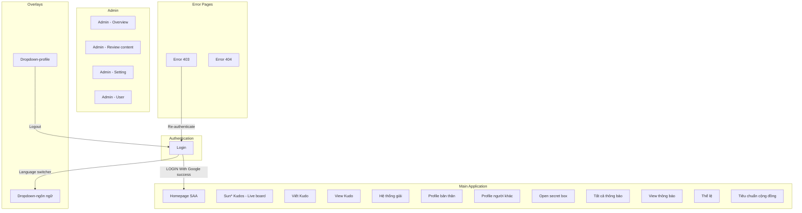
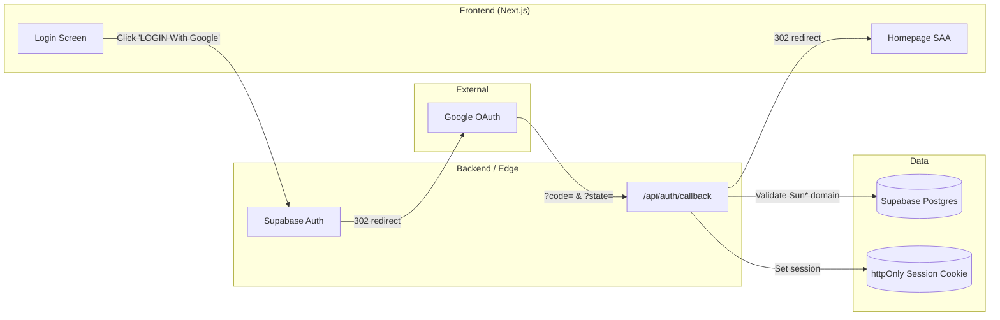

# Screen Flow Overview

## Project Info

- **Project Name**: gnv-saa (Sun\* Awards 2025 / SAA)
- **Figma File Key**: 9ypp4enmFmdK3YAFJLIu6C
- **Figma URL**: https://www.figma.com/design/9ypp4enmFmdK3YAFJLIu6C
- **MoMorph URL**: https://momorph.ai/files/9ypp4enmFmdK3YAFJLIu6C
- **Created**: 2026-05-11
- **Last Updated**: 2026-05-11

---

## Discovery Progress

| Metric                       | Count |
| ---------------------------- | ----- |
| Total Frames in File         | 157   |
| Top-level Screens (in scope) | ~25   |
| Discovered                   | 1     |
| Remaining                    | ~24   |
| Completion                   | 4%    |

> Note: The Figma file contains 157 frames, but most are reusable components (Button, Color, Icon, Typography, dropdowns, hover states) or duplicate variants. The "Top-level Screens" count reflects distinct user-facing screens (web + iOS variants prefixed with `[iOS]`).

---

## Screens

> Status legend: `pending` = not yet processed · `discovered` = spec generated · `analyzed` = deep dive done · `implemented` = code shipped
> Only top-level user-facing screens are listed below; sub-components and overlay variants are intentionally omitted.

### Web Screens

| #   | Screen Name                | Frame ID    | Figma Link                                                                 | Status     | Detail File           | Predicted APIs                                                                    | Navigations To                  |
| --- | -------------------------- | ----------- | -------------------------------------------------------------------------- | ---------- | --------------------- | --------------------------------------------------------------------------------- | ------------------------------- |
| 1   | Login                      | GzbNeVGJHz  | [link](https://momorph.ai/files/9ypp4enmFmdK3YAFJLIu6C/screens/GzbNeVGJHz) | discovered | screen_specs/login.md | `GET /api/auth/session`, `POST /api/auth/signin/google`, `GET /api/auth/callback` | Homepage SAA, Dropdown-ngôn ngữ |
| 2   | Homepage SAA               | i87tDx10uM  | [link](https://momorph.ai/files/9ypp4enmFmdK3YAFJLIu6C/screens/i87tDx10uM) | pending    | —                     | TBD                                                                               | TBD                             |
| 3   | Countdown - Prelaunch page | 8PJQswPZmU  | [link](https://momorph.ai/files/9ypp4enmFmdK3YAFJLIu6C/screens/8PJQswPZmU) | pending    | —                     | TBD                                                                               | TBD                             |
| 4   | Sun\* Kudos - Live board   | MaZUn5xHXZ  | [link](https://momorph.ai/files/9ypp4enmFmdK3YAFJLIu6C/screens/MaZUn5xHXZ) | pending    | —                     | TBD                                                                               | TBD                             |
| 5   | Viết Kudo                  | ihQ26W78P2  | [link](https://momorph.ai/files/9ypp4enmFmdK3YAFJLIu6C/screens/ihQ26W78P2) | pending    | —                     | TBD                                                                               | TBD                             |
| 6   | View Kudo                  | onDIohs2bS  | [link](https://momorph.ai/files/9ypp4enmFmdK3YAFJLIu6C/screens/onDIohs2bS) | pending    | —                     | TBD                                                                               | TBD                             |
| 7   | Hệ thống giải              | zFYDgyj_pD  | [link](https://momorph.ai/files/9ypp4enmFmdK3YAFJLIu6C/screens/zFYDgyj_pD) | pending    | —                     | TBD                                                                               | TBD                             |
| 8   | Profile bản thân           | 3FoIx6ALVb  | [link](https://momorph.ai/files/9ypp4enmFmdK3YAFJLIu6C/screens/3FoIx6ALVb) | pending    | —                     | TBD                                                                               | TBD                             |
| 9   | Profile người khác         | w4WUvsJ9KI  | [link](https://momorph.ai/files/9ypp4enmFmdK3YAFJLIu6C/screens/w4WUvsJ9KI) | pending    | —                     | TBD                                                                               | TBD                             |
| 10  | Open secret box (chưa mở)  | J3-4YFIpMM  | [link](https://momorph.ai/files/9ypp4enmFmdK3YAFJLIu6C/screens/J3-4YFIpMM) | pending    | —                     | TBD                                                                               | TBD                             |
| 11  | Tất cả thông báo           | 6-1LRz3vqr  | [link](https://momorph.ai/files/9ypp4enmFmdK3YAFJLIu6C/screens/6-1LRz3vqr) | pending    | —                     | TBD                                                                               | TBD                             |
| 12  | View thông báo             | gWBVcaSVIf  | [link](https://momorph.ai/files/9ypp4enmFmdK3YAFJLIu6C/screens/gWBVcaSVIf) | pending    | —                     | TBD                                                                               | TBD                             |
| 13  | Thể lệ UPDATE              | b1Filzi9i6  | [link](https://momorph.ai/files/9ypp4enmFmdK3YAFJLIu6C/screens/b1Filzi9i6) | pending    | —                     | TBD                                                                               | TBD                             |
| 14  | Tiêu chuẩn cộng đồng       | Dpn7C89--r  | [link](https://momorph.ai/files/9ypp4enmFmdK3YAFJLIu6C/screens/Dpn7C89--r) | pending    | —                     | TBD                                                                               | TBD                             |
| 15  | Error page - 403           | T3e_iS9PCL  | [link](https://momorph.ai/files/9ypp4enmFmdK3YAFJLIu6C/screens/T3e_iS9PCL) | pending    | —                     | TBD                                                                               | TBD                             |
| 16  | Error page - 404           | p0yJ89B-9\_ | [link](https://momorph.ai/files/9ypp4enmFmdK3YAFJLIu6C/screens/p0yJ89B-9_) | pending    | —                     | TBD                                                                               | TBD                             |
| 17  | Admin - Overview           | 9ja9g9iJLW  | [link](https://momorph.ai/files/9ypp4enmFmdK3YAFJLIu6C/screens/9ja9g9iJLW) | pending    | —                     | TBD                                                                               | TBD                             |
| 18  | Admin - Review content     | MTExSUSdUn  | [link](https://momorph.ai/files/9ypp4enmFmdK3YAFJLIu6C/screens/MTExSUSdUn) | pending    | —                     | TBD                                                                               | TBD                             |
| 19  | Admin - Setting            | fTCVEC9aV\_ | [link](https://momorph.ai/files/9ypp4enmFmdK3YAFJLIu6C/screens/fTCVEC9aV_) | pending    | —                     | TBD                                                                               | TBD                             |
| 20  | Admin - User               | -u1lKib0JL  | [link](https://momorph.ai/files/9ypp4enmFmdK3YAFJLIu6C/screens/-u1lKib0JL) | pending    | —                     | TBD                                                                               | TBD                             |

### iOS Screens (companion app, optional scope)

| #   | Screen Name            | Frame ID    | Status  |
| --- | ---------------------- | ----------- | ------- |
| 21  | [iOS] Login            | 8HGlvYGJWq  | pending |
| 22  | [iOS] Home             | OuH1BUTYT0  | pending |
| 23  | [iOS] Sun\*Kudos       | fO0Kt19sZZ  | pending |
| 24  | [iOS] Profile bản thân | hSH7L8doXB  | pending |
| 25  | [iOS] Notifications    | \_b68CBWKl5 | pending |

> Additional iOS variants (Search, dropdowns, secret box states, awards) are listed in the full Figma index; they will be processed as needed.

---

## Navigation Graph

### Navigation Edges — Login (this iteration)

| Trigger                                            | Destination URL                                                 | Confidence |
| -------------------------------------------------- | --------------------------------------------------------------- | ---------- |
| Click "LOGIN With Google" → OAuth callback success | `/` (Homepage SAA)                                              | high       |
| Click language switcher in header                  | `#language-dropdown` (overlay, no route change)                 | high       |
| External OAuth redirect                            | `https://accounts.google.com/...` then back to `/auth/callback` | high       |

---

## Screen Groups

### Group: Authentication

| Screen | Purpose                                  | Entry Points                                      |
| ------ | ---------------------------------------- | ------------------------------------------------- |
| Login  | Google OAuth sign-in for Sun\* employees | App launch (unauthenticated), Logout, 403 re-auth |

### Group: Main Application (planned)

| Screen                   | Purpose                       | Entry Points                        |
| ------------------------ | ----------------------------- | ----------------------------------- |
| Homepage SAA             | Main landing page after login | Login success                       |
| Sun\* Kudos - Live board | Live feed of all kudos        | Top navigation                      |
| Viết Kudo                | Compose new kudo message      | Kudos board, Floating Action Button |
| View Kudo                | Read a single kudo            | Kudos card click                    |
| Hệ thống giải            | Awards system / categories    | Top navigation                      |
| Profile bản thân         | Logged-in user profile        | Profile dropdown                    |
| Profile người khác       | Other users' profiles         | Kudo author/recipient link          |
| Open secret box          | Reveal kudo gift box          | Notifications, dashboard            |
| Tất cả thông báo         | All notifications list        | Bell icon                           |
| Thể lệ                   | Awards rules / regulations    | Footer link                         |
| Tiêu chuẩn cộng đồng     | Community guidelines          | Footer link                         |

### Group: Admin (planned)

| Screen                 | Purpose               | Entry Points           |
| ---------------------- | --------------------- | ---------------------- |
| Admin - Overview       | Admin dashboard       | Admin profile dropdown |
| Admin - Review content | Moderate kudo content | Admin overview         |
| Admin - Setting        | Campaign settings     | Admin overview         |
| Admin - User           | User management       | Admin overview         |

### Group: Errors

| Screen           | Purpose          | Entry Points                    |
| ---------------- | ---------------- | ------------------------------- |
| Error page - 403 | Forbidden access | Protected-route guard rejection |
| Error page - 404 | Not found        | Unmatched route                 |

---

## API Endpoints Summary

| Endpoint                  | Method | Screens Using         | Purpose                                                                 |
| ------------------------- | ------ | --------------------- | ----------------------------------------------------------------------- |
| `/api/auth/session`       | GET    | Login                 | Detect existing Supabase session on mount                               |
| `/api/auth/signin/google` | POST   | Login                 | Initiate Google OAuth flow via Supabase                                 |
| `/api/auth/callback`      | GET    | Login                 | OAuth callback — exchange code for session, validate Sun\* email domain |
| `/api/i18n/locale`        | PUT    | Login (+ all screens) | Persist locale preference (vi/en/ja)                                    |

> Additional endpoints (kudos, awards, users, notifications, admin) will be added as remaining screens are processed.

---

## Data Flow

---

## Technical Notes

### Authentication Flow

- **Provider**: Supabase Auth with Google OAuth.
- **Session storage**: `httpOnly`, `secure`, `sameSite=lax` cookie set by `/api/auth/callback`.
- **Domain gating**: Sun\* email-domain allowlist enforced **server-side** in the callback route (Principle IV — OWASP).
- **Refresh**: Supabase SDK handles silent token refresh; long-lived sessions opt-in.

### State Management

- **Global state**: Zustand for ephemeral client state (e.g., language dropdown open, cached user profile).
- **Server state**: TanStack Query (React Query) for `users/me`, kudos lists, notifications.
- **Auth state**: Supabase JS client subscribed at app root; mirrored into a thin `authStore`.

### Routing

- **Router**: Next.js 16 App Router.
- **Protected routes**: Middleware (`middleware.ts`) validates the Supabase session cookie and redirects unauthenticated users to `/login`.
- **Locale routing**: Either path-based (`/[locale]/...`) or cookie-driven — to be decided in `momorph.plan`.

### Internationalization

- Languages observed in Figma: Vietnamese (default), English, Japanese.
- All copy on Login is currently Vietnamese (e.g., "Bắt đầu hành trình của bạn cùng SAA 2025."); needs i18n keys.

---

## Discovery Log

| Date       | Action            | Screens | Notes                                                                                                                                                          |
| ---------- | ----------------- | ------- | -------------------------------------------------------------------------------------------------------------------------------------------------------------- |
| 2026-05-11 | Initial discovery | Login   | Mapped Google OAuth flow, header language switcher, and outgoing edges to Homepage SAA. Identified Header & Footer as shared components reused across screens. |

---

## Next Steps

- [ ] Process **Homepage SAA** (`i87tDx10uM`) next — it is the post-login landing and the hub for most outgoing edges.
- [ ] Process **Sun\* Kudos - Live board**, **Viết Kudo**, **View Kudo** as a cluster (core feature).
- [ ] Add **Profile bản thân / Profile người khác** to map user-related navigation.
- [ ] Then admin cluster (`Admin - Overview` first).
- [ ] Verify all navigation edges with design team before locking the graph.
- [ ] Generate OpenAPI spec via `momorph.apispecs` once auth + at least 3 feature screens are discovered.
- [ ] Decide whether iOS screens are in-scope for this web project or split to a sibling repo.
