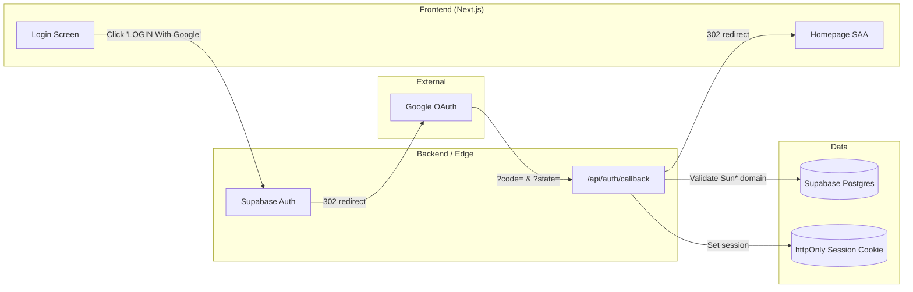

# Screen Flow Overview

## Project Info

- **Project Name**: gnv-saa (Sun\* Awards 2025 / SAA)
- **Figma File Key**: 9ypp4enmFmdK3YAFJLIu6C
- **Figma URL**: https://www.figma.com/design/9ypp4enmFmdK3YAFJLIu6C
- **MoMorph URL**: https://momorph.ai/files/9ypp4enmFmdK3YAFJLIu6C
- **Created**: 2026-05-11
- **Last Updated**: 2026-05-14

---

## Discovery Progress

| Metric                       | Count |
| ---------------------------- | ----- |
| Total Frames in File         | 157   |
| Top-level Screens (in scope) | ~25   |
| Discovered                   | 4     |
| Remaining                    | ~21   |
| Completion                   | 16%   |

> Note: The Figma file contains 157 frames, but most are reusable components (Button, Color, Icon, Typography, dropdowns, hover states) or duplicate variants. The "Top-level Screens" count reflects distinct user-facing screens (web + iOS variants prefixed with `[iOS]`).

---

## Screens

> Status legend: `pending` = not yet processed · `discovered` = spec generated · `analyzed` = deep dive done · `implemented` = code shipped
> Only top-level user-facing screens are listed below; sub-components and overlay variants are intentionally omitted.

### Web Screens

| #   | Screen Name                | Frame ID    | Figma Link                                                                 | Status          | Detail File                                   | Predicted APIs                                                                                                                                                                                                                                                                                                                                                                                                                         | Navigations To                                                                                                                                                                                                                                                                           |
| --- | -------------------------- | ----------- | -------------------------------------------------------------------------- | --------------- | --------------------------------------------- | -------------------------------------------------------------------------------------------------------------------------------------------------------------------------------------------------------------------------------------------------------------------------------------------------------------------------------------------------------------------------------------------------------------------------------------- | ---------------------------------------------------------------------------------------------------------------------------------------------------------------------------------------------------------------------------------------------------------------------------------------- |
| 1   | Login                      | GzbNeVGJHz  | [link](https://momorph.ai/files/9ypp4enmFmdK3YAFJLIu6C/screens/GzbNeVGJHz) | discovered      | screen_specs/login.md                         | `GET /api/auth/session`, `POST /api/auth/signin/google`, `GET /api/auth/callback`                                                                                                                                                                                                                                                                                                                                                      | Homepage SAA, Dropdown-ngôn ngữ                                                                                                                                                                                                                                                          |
| 2   | Homepage SAA               | i87tDx10uM  | [link](https://momorph.ai/files/9ypp4enmFmdK3YAFJLIu6C/screens/i87tDx10uM) | **implemented** | screen_specs/homepage-saa.md                  | `GET /api/auth/session`, `GET /api/users/me`, `GET /api/notifications/unread-count`, `GET /api/notifications?limit=5`, `POST /api/auth/signout`, `PUT /api/i18n/locale` (event datetime is build-time env var, no API)                                                                                                                                                                                                                 | Awards Information, Sun\* Kudos - Live board, Tất cả thông báo (via "See all"), Tiêu chuẩn cộng đồng, Dropdown-profile, Dropdown-ngôn ngữ, Login (on sign-out / anonymous "Sign in")                                                                                                     |
| 3   | Countdown - Prelaunch page | 8PJQswPZmU  | [link](https://momorph.ai/files/9ypp4enmFmdK3YAFJLIu6C/screens/8PJQswPZmU) | discovered      | screen_specs/countdown-prelaunch.md           | (none) — Event datetime is build-time env var `NEXT_PUBLIC_EVENT_START_AT`. Routing decision lives in `middleware.ts`. No API calls on this screen.                                                                                                                                                                                                                                                                                    | Homepage SAA (auto-redirect when countdown reaches `00 / 00 / 00`). No user-triggered navigation — page has no header, footer, buttons, or links.                                                                                                                                        |
| 4   | Sun\* Kudos - Live board   | MaZUn5xHXZ  | [link](https://momorph.ai/files/9ypp4enmFmdK3YAFJLIu6C/screens/MaZUn5xHXZ) | spec_drafted    | specs/MaZUn5xHXZ-sun-kudos-live-board/spec.md | (predicted) `GET /api/kudos?sort=hearts&limit=5`, `GET /api/kudos?sort=newest&cursor`, `GET /api/kudos/spotlight`, `GET /api/kudos/hashtags`, `GET /api/kudos/departments`, `POST/DELETE /api/kudos/{id}/like`, `GET /api/users/me/stats`, `GET /api/users/me/leaderboard?type=…`, `GET /api/secret-boxes/next-unopened`. Reuses Homepage SAA: `GET /api/auth/session`, `GET /api/notifications/unread-count`, `PUT /api/i18n/locale`. | Viết Kudo (`/kudos/new` via quick-capture A.1), Kudo detail (`/kudos/{id}` via card click/View Details/Spotlight node), Profile (`/profile/{userId}` via sender/recipient/leaderboard click), Login (`/login?redirectTo=/kudos*` for anonymous interactions), in-page Secret Box dialog. |
| 5   | Viết Kudo                  | ihQ26W78P2  | [link](https://momorph.ai/files/9ypp4enmFmdK3YAFJLIu6C/screens/ihQ26W78P2) | pending         | —                                             | TBD                                                                                                                                                                                                                                                                                                                                                                                                                                    | TBD                                                                                                                                                                                                                                                                                      |
| 6   | View Kudo                  | onDIohs2bS  | [link](https://momorph.ai/files/9ypp4enmFmdK3YAFJLIu6C/screens/onDIohs2bS) | pending         | —                                             | TBD                                                                                                                                                                                                                                                                                                                                                                                                                                    | TBD                                                                                                                                                                                                                                                                                      |
| 7   | Hệ thống giải              | zFYDgyj_pD  | [link](https://momorph.ai/files/9ypp4enmFmdK3YAFJLIu6C/screens/zFYDgyj_pD) | **implemented** | screen_specs/he-thong-giai.md                 | (reuses Homepage SAA endpoints) `GET /api/users/me`, `GET /api/notifications/unread-count`, `GET /api/notifications?limit=5`, `POST /api/auth/signout`, `PUT /api/i18n/locale`. Content is static (`lib/awards/{config,details}.ts`).                                                                                                                                                                                                  | Sun\* Kudos - Live board, Homepage SAA (logo + 'About SAA 2025'), Tiêu chuẩn cộng đồng, Login (if anonymous), in-page sidebar scroll to `#{slug}` (sticky scrollspy + deep-link hash)                                                                                                    |
| 8   | Profile bản thân           | 3FoIx6ALVb  | [link](https://momorph.ai/files/9ypp4enmFmdK3YAFJLIu6C/screens/3FoIx6ALVb) | pending         | —                                             | TBD                                                                                                                                                                                                                                                                                                                                                                                                                                    | TBD                                                                                                                                                                                                                                                                                      |
| 9   | Profile người khác         | w4WUvsJ9KI  | [link](https://momorph.ai/files/9ypp4enmFmdK3YAFJLIu6C/screens/w4WUvsJ9KI) | pending         | —                                             | TBD                                                                                                                                                                                                                                                                                                                                                                                                                                    | TBD                                                                                                                                                                                                                                                                                      |
| 10  | Open secret box (chưa mở)  | J3-4YFIpMM  | [link](https://momorph.ai/files/9ypp4enmFmdK3YAFJLIu6C/screens/J3-4YFIpMM) | pending         | —                                             | TBD                                                                                                                                                                                                                                                                                                                                                                                                                                    | TBD                                                                                                                                                                                                                                                                                      |
| 11  | Tất cả thông báo           | 6-1LRz3vqr  | [link](https://momorph.ai/files/9ypp4enmFmdK3YAFJLIu6C/screens/6-1LRz3vqr) | pending         | —                                             | TBD                                                                                                                                                                                                                                                                                                                                                                                                                                    | TBD                                                                                                                                                                                                                                                                                      |
| 12  | View thông báo             | gWBVcaSVIf  | [link](https://momorph.ai/files/9ypp4enmFmdK3YAFJLIu6C/screens/gWBVcaSVIf) | pending         | —                                             | TBD                                                                                                                                                                                                                                                                                                                                                                                                                                    | TBD                                                                                                                                                                                                                                                                                      |
| 13  | Thể lệ UPDATE              | b1Filzi9i6  | [link](https://momorph.ai/files/9ypp4enmFmdK3YAFJLIu6C/screens/b1Filzi9i6) | pending         | —                                             | TBD                                                                                                                                                                                                                                                                                                                                                                                                                                    | TBD                                                                                                                                                                                                                                                                                      |
| 14  | Tiêu chuẩn cộng đồng       | Dpn7C89--r  | [link](https://momorph.ai/files/9ypp4enmFmdK3YAFJLIu6C/screens/Dpn7C89--r) | pending         | —                                             | TBD                                                                                                                                                                                                                                                                                                                                                                                                                                    | TBD                                                                                                                                                                                                                                                                                      |
| 15  | Error page - 403           | T3e_iS9PCL  | [link](https://momorph.ai/files/9ypp4enmFmdK3YAFJLIu6C/screens/T3e_iS9PCL) | pending         | —                                             | TBD                                                                                                                                                                                                                                                                                                                                                                                                                                    | TBD                                                                                                                                                                                                                                                                                      |
| 16  | Error page - 404           | p0yJ89B-9\_ | [link](https://momorph.ai/files/9ypp4enmFmdK3YAFJLIu6C/screens/p0yJ89B-9_) | pending         | —                                             | TBD                                                                                                                                                                                                                                                                                                                                                                                                                                    | TBD                                                                                                                                                                                                                                                                                      |
| 17  | Admin - Overview           | 9ja9g9iJLW  | [link](https://momorph.ai/files/9ypp4enmFmdK3YAFJLIu6C/screens/9ja9g9iJLW) | pending         | —                                             | TBD                                                                                                                                                                                                                                                                                                                                                                                                                                    | TBD                                                                                                                                                                                                                                                                                      |
| 18  | Admin - Review content     | MTExSUSdUn  | [link](https://momorph.ai/files/9ypp4enmFmdK3YAFJLIu6C/screens/MTExSUSdUn) | pending         | —                                             | TBD                                                                                                                                                                                                                                                                                                                                                                                                                                    | TBD                                                                                                                                                                                                                                                                                      |
| 19  | Admin - Setting            | fTCVEC9aV\_ | [link](https://momorph.ai/files/9ypp4enmFmdK3YAFJLIu6C/screens/fTCVEC9aV_) | pending         | —                                             | TBD                                                                                                                                                                                                                                                                                                                                                                                                                                    | TBD                                                                                                                                                                                                                                                                                      |
| 20  | Admin - User               | -u1lKib0JL  | [link](https://momorph.ai/files/9ypp4enmFmdK3YAFJLIu6C/screens/-u1lKib0JL) | pending         | —                                             | TBD                                                                                                                                                                                                                                                                                                                                                                                                                                    | TBD                                                                                                                                                                                                                                                                                      |

### iOS Screens (companion app, optional scope)

| #   | Screen Name            | Frame ID    | Status  |
| --- | ---------------------- | ----------- | ------- |
| 21  | [iOS] Login            | 8HGlvYGJWq  | pending |
| 22  | [iOS] Home             | OuH1BUTYT0  | pending |
| 23  | [iOS] Sun\*Kudos       | fO0Kt19sZZ  | pending |
| 24  | [iOS] Profile bản thân | hSH7L8doXB  | pending |
| 25  | [iOS] Notifications    | \_b68CBWKl5 | pending |

> Additional iOS variants (Search, dropdowns, secret box states, awards) are listed in the full Figma index; they will be processed as needed.

---

## Navigation Graph

```mermaid
flowchart TD
    subgraph Auth["Authentication"]
        Login[Login]
    end

    subgraph Prelaunch["Prelaunch"]
        PrelaunchScreen[Countdown - Prelaunch page]
    end

    subgraph Main["Main Application"]
        Home[Homepage SAA]
        Kudos[Sun* Kudos - Live board]
        WriteKudo[Viết Kudo]
        ViewKudo[View Kudo]
        Awards[Hệ thống giải]
        ProfileSelf[Profile bản thân]
        ProfileOther[Profile người khác]
        SecretBox[Open secret box]
        Notifications[Tất cả thông báo]
        ViewNotif[View thông báo]
        Rules[Thể lệ]
        Community[Tiêu chuẩn cộng đồng]
    end

    subgraph Admin["Admin"]
        AdminOverview[Admin - Overview]
        AdminReview[Admin - Review content]
        AdminSetting[Admin - Setting]
        AdminUser[Admin - User]
    end

    subgraph Errors["Error Pages"]
        E403[Error 403]
        E404[Error 404]
    end

    subgraph Overlays["Overlays"]
        LangDropdown[Dropdown-ngôn ngữ]
        ProfileDropdown[Dropdown-profile]
    end

    Login -->|LOGIN With Google success| Home
    Login -->|Language switcher| LangDropdown
    ProfileDropdown -->|Logout| Login
    E403 -->|Re-authenticate| Login

    PrelaunchScreen -->|Countdown reaches 00 / 00 / 00 → middleware re-eval| Home
    Home -.->|now &lt; NEXT_PUBLIC_EVENT_START_AT (middleware rewrite)| PrelaunchScreen
    Login -.->|now &lt; NEXT_PUBLIC_EVENT_START_AT (middleware rewrite)| PrelaunchScreen
    Awards -.->|now &lt; NEXT_PUBLIC_EVENT_START_AT (middleware rewrite)| PrelaunchScreen

    Home -->|Header 'Awards Information' / CTA 'ABOUT AWARDS' / Award card| Awards
    Home -->|Header 'Sun* Kudos' / CTA 'ABOUT KUDOS' / Kudos 'Chi tiết'| Kudos
    Home -->|Footer 'Tiêu chuẩn chung'| Community
    Home -->|Bell icon| Notifications
    Home -->|Avatar| ProfileDropdown
    Home -->|Language switcher| LangDropdown
    Home -->|Widget 'Viết Kudo'| WriteKudo
    ProfileDropdown -->|'Profile'| ProfileSelf
    ProfileDropdown -->|'Admin Dashboard' (admin only)| AdminOverview

    Awards -->|Sidebar item click (in-page scroll)| Awards
    Awards -->|Sun* Kudos 'Chi tiết'| Kudos
    Awards -->|Header/Footer logo + 'About SAA 2025'| Home
    Awards -->|Footer 'Tiêu chuẩn chung'| Community
    Awards -->|Anonymous access (middleware)| Login
```

### Navigation Edges — Login (initial iteration)

| Trigger                                            | Destination URL                                                 | Confidence |
| -------------------------------------------------- | --------------------------------------------------------------- | ---------- |
| Click "LOGIN With Google" → OAuth callback success | `/` (Homepage SAA)                                              | high       |
| Click language switcher in header                  | `#language-dropdown` (overlay, no route change)                 | high       |
| External OAuth redirect                            | `https://accounts.google.com/...` then back to `/auth/callback` | high       |

### Navigation Edges — Hệ thống giải / Awards Information (this iteration)

| Trigger                                                      | Destination URL                       | Confidence        |
| ------------------------------------------------------------ | ------------------------------------- | ----------------- |
| Sidebar item click (C.1–C.6)                                 | `/awards#{slug}` (in-page scroll)     | high              |
| Sun\* Kudos block "Chi tiết"                                 | `/kudos`                              | high              |
| Header logo / "About SAA 2025"                               | `/`                                   | high              |
| Header "Sun\* Kudos"                                         | `/kudos`                              | high              |
| Footer "About SAA 2025" / "Sun\* Kudos" / "Tiêu chuẩn chung" | `/`, `/kudos`, `/community-standards` | high (TCC medium) |
| Anonymous access (middleware enforcement)                    | `/login?redirectTo=/awards#{slug}`    | high              |

> Auth requirement: spec Test ID-1 mandates the page is authenticated-only. Middleware `isProtectedPath()` must add `/awards` after this screen ships.

### Navigation Edges — Countdown - Prelaunch page (this iteration)

| Trigger                                                                  | Destination URL                         | Confidence |
| ------------------------------------------------------------------------ | --------------------------------------- | ---------- |
| Middleware: `now() < NEXT_PUBLIC_EVENT_START_AT` on **any** public route | `/prelaunch` (rewrite, URL unchanged)   | high       |
| Countdown reaches `00 / 00 / 00` (client tick)                           | `router.refresh()` → re-render Homepage | high       |
| Countdown reaches `00 / 00 / 00` (next SSR)                              | `/` (Homepage SAA, normal flow)         | high       |
| User clicks anywhere on screen                                           | (no-op — no interactive elements)       | high       |
| User opens `/login`, `/awards`, `/kudos`, … during prelaunch             | Rewritten to `/prelaunch` by middleware | high       |

> Auth requirement: **None** — the page is public. **However**, it overrides every other route during the prelaunch window (including authenticated routes). Middleware MUST check `isPrelaunch()` before `isProtectedPath()`. SEO: should ship with `<meta name="robots" content="noindex">` until launch.

### Navigation Edges — Homepage SAA (initial iteration)

| Trigger                                                            | Destination URL                                         | Confidence |
| ------------------------------------------------------------------ | ------------------------------------------------------- | ---------- |
| Click header logo / footer logo                                    | `/` (scroll to top)                                     | high       |
| Click "About SAA 2025" (header / footer)                           | `/` (scroll to top / `#about`)                          | high       |
| Click "Awards Information" (header / footer) or CTA "ABOUT AWARDS" | `/awards`                                               | high       |
| Click "Sun\* Kudos" (header / footer) or CTA "ABOUT KUDOS"         | `/kudos`                                                | high       |
| Click award card image / title / "Chi tiết"                        | `/awards#{award-slug}` (e.g. `#top-talent`)             | high       |
| Click "Chi tiết" in Sun\* Kudos promo block                        | `/kudos`                                                | high       |
| Click "Tiêu chuẩn chung" (footer)                                  | `/community-standards`                                  | medium     |
| Click bell icon                                                    | Notification overlay; or `/notifications` if full list  | high       |
| Click language switcher (VN)                                       | `Dropdown-ngôn ngữ` overlay; `PUT /api/i18n/locale`     | high       |
| Click avatar                                                       | `Dropdown-profile` (721:5223) overlay                   | high       |
| Profile dropdown → "Profile"                                       | `/profile`                                              | medium     |
| Profile dropdown → "Sign out"                                      | `POST /api/auth/signout` → `/login`                     | high       |
| Profile dropdown → "Admin Dashboard" (admin only)                  | `/admin`                                                | high       |
| Click floating widget pill                                         | Quick-action menu overlay (then `/kudos/new`, `/rules`) | medium     |

---

## Screen Groups

### Group: Prelaunch

| Screen                     | Purpose                                                                                       | Entry Points                                                                                  |
| -------------------------- | --------------------------------------------------------------------------------------------- | --------------------------------------------------------------------------------------------- |
| Countdown - Prelaunch page | Public, content-free landing shown to every visitor before `NEXT_PUBLIC_EVENT_START_AT` hits. | Middleware rewrite from any public path while `now() < NEXT_PUBLIC_EVENT_START_AT` is `true`. |

### Group: Authentication

| Screen | Purpose                                  | Entry Points                                      |
| ------ | ---------------------------------------- | ------------------------------------------------- |
| Login  | Google OAuth sign-in for Sun\* employees | App launch (unauthenticated), Logout, 403 re-auth |

### Group: Main Application (planned)

| Screen                   | Purpose                       | Entry Points                        |
| ------------------------ | ----------------------------- | ----------------------------------- |
| Homepage SAA             | Main landing page after login | Login success                       |
| Sun\* Kudos - Live board | Live feed of all kudos        | Top navigation                      |
| Viết Kudo                | Compose new kudo message      | Kudos board, Floating Action Button |
| View Kudo                | Read a single kudo            | Kudos card click                    |
| Hệ thống giải            | Awards system / categories    | Top navigation                      |
| Profile bản thân         | Logged-in user profile        | Profile dropdown                    |
| Profile người khác       | Other users' profiles         | Kudo author/recipient link          |
| Open secret box          | Reveal kudo gift box          | Notifications, dashboard            |
| Tất cả thông báo         | All notifications list        | Bell icon                           |
| Thể lệ                   | Awards rules / regulations    | Footer link                         |
| Tiêu chuẩn cộng đồng     | Community guidelines          | Footer link                         |

### Group: Admin (planned)

| Screen                 | Purpose               | Entry Points           |
| ---------------------- | --------------------- | ---------------------- |
| Admin - Overview       | Admin dashboard       | Admin profile dropdown |
| Admin - Review content | Moderate kudo content | Admin overview         |
| Admin - Setting        | Campaign settings     | Admin overview         |
| Admin - User           | User management       | Admin overview         |

### Group: Errors

| Screen           | Purpose          | Entry Points                    |
| ---------------- | ---------------- | ------------------------------- |
| Error page - 403 | Forbidden access | Protected-route guard rejection |
| Error page - 404 | Not found        | Unmatched route                 |

---

## API Endpoints Summary

| Endpoint                          | Method | Screens Using               | Purpose                                                                 |
| --------------------------------- | ------ | --------------------------- | ----------------------------------------------------------------------- |
| `/api/auth/session`               | GET    | Login, Homepage SAA         | Detect existing Supabase session on mount                               |
| `/api/auth/signin/google`         | POST   | Login                       | Initiate Google OAuth flow via Supabase                                 |
| `/api/auth/callback`              | GET    | Login                       | OAuth callback — exchange code for session, validate Sun\* email domain |
| `/api/auth/signout`               | POST   | Homepage SAA                | Sign out (clears session cookie, redirects to `/login`)                 |
| `/api/users/me`                   | GET    | Homepage SAA, (Profile)     | Load current user profile (avatar, role, locale) — auth-only            |
| `/api/notifications`              | GET    | Notifications page          | Paginated notifications list                                            |
| `/api/notifications?limit=5`      | GET    | Homepage SAA, Hệ thống giải | Latest N notifications for bell overlay preview — auth-only             |
| `/api/notifications/unread-count` | GET    | Homepage SAA, Hệ thống giải | Unread-indicator badge on bell — auth-only                              |
| `/api/i18n/locale`                | PUT    | Login (+ all screens)       | Persist locale preference (vi/en)                                       |

> **Note**: Event start datetime for the Homepage SAA countdown is a build-time env var (`NEXT_PUBLIC_EVENT_START_AT`), **not** an API.

> Additional endpoints (kudos, awards, users, notifications, admin) will be added as remaining screens are processed.

---

## Data Flow



---

## Technical Notes

### Authentication Flow

- **Provider**: Supabase Auth with Google OAuth.
- **Session storage**: `httpOnly`, `secure`, `sameSite=lax` cookie set by `/api/auth/callback`.
- **Domain gating**: Sun\* email-domain allowlist enforced **server-side** in the callback route (Principle IV — OWASP).
- **Refresh**: Supabase SDK handles silent token refresh; long-lived sessions opt-in.

### State Management

- **Global state**: Zustand for ephemeral client state (e.g., language dropdown open, cached user profile).
- **Server state**: TanStack Query (React Query) for `users/me`, kudos lists, notifications.
- **Auth state**: Supabase JS client subscribed at app root; mirrored into a thin `authStore`.

### Routing

- **Router**: Next.js 16 App Router.
- **Protected routes**: Middleware (`middleware.ts`) validates the Supabase session cookie and redirects unauthenticated users to `/login`.
- **Locale routing**: Either path-based (`/[locale]/...`) or cookie-driven — to be decided in `momorph.plan`.

### Internationalization

- Languages observed in Figma: Vietnamese (default), English, Japanese.
- All copy on Login is currently Vietnamese (e.g., "Bắt đầu hành trình của bạn cùng SAA 2025."); needs i18n keys.

---

## Discovery Log

| Date       | Action              | Screens                    | Notes                                                                                                                                                                                                                                                                                                                                                                                                                                                                                                                                                                                                                                                                                                                                                                                                                                                                                                                                                                                                                                                                                                                                                                              |
| ---------- | ------------------- | -------------------------- | ---------------------------------------------------------------------------------------------------------------------------------------------------------------------------------------------------------------------------------------------------------------------------------------------------------------------------------------------------------------------------------------------------------------------------------------------------------------------------------------------------------------------------------------------------------------------------------------------------------------------------------------------------------------------------------------------------------------------------------------------------------------------------------------------------------------------------------------------------------------------------------------------------------------------------------------------------------------------------------------------------------------------------------------------------------------------------------------------------------------------------------------------------------------------------------- |
| 2026-05-11 | Initial discovery   | Login                      | Mapped Google OAuth flow, header language switcher, and outgoing edges to Homepage SAA. Identified Header & Footer as shared components reused across screens.                                                                                                                                                                                                                                                                                                                                                                                                                                                                                                                                                                                                                                                                                                                                                                                                                                                                                                                                                                                                                     |
| 2026-05-13 | Discovery           | Homepage SAA               | Mapped hero (Keyvisual + Countdown + CTA), 6 award cards (Top Talent, Top Project, Top Project Leader, Best Manager, Signature 2025 - Creator, MVP), Sun\* Kudos promo, floating widget (Viết Kudo + Thể lệ SAA), footer. Hashtag deep links to `/awards#{slug}` introduced.                                                                                                                                                                                                                                                                                                                                                                                                                                                                                                                                                                                                                                                                                                                                                                                                                                                                                                       |
| 2026-05-13 | Spec review         | Homepage SAA               | Locked decisions via `momorph.reviewspecify`: event datetime is env-var only (no `/api/event/config`); anonymous avatar opens a `Sign in` menu; notification bell opens an inline overlay with latest 5 + `See all` link to `/notifications`; widget overlay = `Viết Kudo` + `Thể lệ SAA`. Predicted endpoints narrowed to `users/me`, `notifications/unread-count`, `notifications?limit=5`, `auth/signout`.                                                                                                                                                                                                                                                                                                                                                                                                                                                                                                                                                                                                                                                                                                                                                                      |
| 2026-05-13 | MVP implementation  | Homepage SAA               | Shipped Phase 1+2+3 of the plan (initial MVP — 54 tasks). Foundation: assets + DB migration + i18n + locale narrowing (vi/en) + awards catalogue + event helper + services + AppHeader/AppFooter extensions + middleware unlocked + 8 `Coming soon` placeholders. US1 (Awards discovery): AwardCard + AwardsGridSection + HomepageHeader baseline. 183 tests green.                                                                                                                                                                                                                                                                                                                                                                                                                                                                                                                                                                                                                                                                                                                                                                                                                |
| 2026-05-13 | Full implementation | Homepage SAA               | All 6 user stories shipped (US1–US6). US2: CountdownTile + CountdownTimer + HeroSection (live tick every 60s; FR-009 fallback). US3: BellIcon + UnreadBadge + NotificationButton + NotificationOverlay + ProfileMenu (anon/user/admin variants). US4: LanguageSwitcher wired with Toast for FR-026 failure path. US5: KudosPromoSection + QuickActionWidget (Viết Kudo / Thể lệ SAA). US6: NavLink + HeaderNav (active state via `aria-current="page"`). **Final state**: 242/242 tests pass, lint clean, typecheck clean, `next build` green (13 routes generated). Deferred: 8 E2E task IDs (T068/T077/T094/T104/T115/T125) need a running Playwright environment + the manual T008 supabase reset verification + Polish phase tasks (axe sweep + Lighthouse measurement + i18n audit can run in CI).                                                                                                                                                                                                                                                                                                                                                                            |
| 2026-05-14 | Discovery           | Hệ thống giải              | Mapped keyvisual banner + title block + 2-column body (sticky sidebar with 6 nav items + 6 award detail cards in order: Top Talent → Top Project → Top Project Leader → Best Manager → Signature 2025-Creator → MVP) + reused Sun\* Kudos promo + footer. Page content is static (extends `lib/awards/config.ts` with quantity/value strings). Spec Test ID-1 marks this page authenticated-only — `isProtectedPath('/awards')` to be added when shipping. Sidebar uses anchor links + IntersectionObserver scrollspy.                                                                                                                                                                                                                                                                                                                                                                                                                                                                                                                                                                                                                                                             |
| 2026-05-14 | Full implementation | Hệ thống giải              | All 5 user stories shipped (US1–US5). Foundation: `lib/awards/details.ts` static catalogue + i18n keys (`awardsPage.*` + 6 `longDescription.*` keys) + `/awards` added to `isProtectedPath()` middleware + `tests/setup.ts` polyfills (`IntersectionObserver` + `matchMedia` + `scrollIntoView`). US1: `KeyvisualBanner` + `AwardsPageTitle` + `AwardDetailCard` + `AwardsContentList` + page composition. US2: `AwardsSidebarItem` + `AwardsSidebarNav` (`'use client'` — single client island; scrollspy via IntersectionObserver with 250 ms isProgrammaticScroll guard; `prefers-reduced-motion` respects `'instant'`; click → smooth scroll + `history.replaceState(#{slug})`). US3: lazy `useState` initializer reads `window.location.hash` on mount (avoids `react-hooks/set-state-in-effect`); unknown hash falls back to first slug without scrolling. US4/US5: shared `KudosPromoSection` + `HomepageHeader` + `AppFooter variant="homepage"` reused unchanged. **Final state**: 284/284 unit tests pass, lint clean, typecheck clean. Deferred to Polish: Playwright E2E (T045/T052/T061/T071/T080-T082), Lighthouse run (T083), README update (T085), CI gate (T087). |
| 2026-05-14 | Discovery           | Countdown - Prelaunch page | Mapped full-bleed prelaunch landing: `MM_MEDIA_BG Image` (2268:35129) + `Cover` (2268:35130) overlay + `Bìa` hero (2268:35131) containing only `Countdown time` (2268:35136) with headline "Sự kiện sẽ bắt đầu sau" and three `CountdownTile`s (DAYS / HOURS / MINUTES — no seconds). Zero interactive elements; no header/footer. Reuses `CountdownTimer` + `CountdownTile` from Homepage SAA. Drives `prelaunch` middleware gate: while `now() < NEXT_PUBLIC_EVENT_START_AT`, all public routes rewrite to `/prelaunch`; when the countdown hits zero the client triggers `router.refresh()` so middleware re-evaluates and Homepage SAA renders. No APIs.                                                                                                                                                                                                                                                                                                                                                                                                                                                                                                                       |

---

## Next Steps

- [x] Process **Homepage SAA** (`i87tDx10uM`) — completed 2026-05-13.
- [x] Process **Awards Information / Hệ thống giải** (`zFYDgyj_pD`) — completed 2026-05-14.
- [x] Process **Countdown - Prelaunch page** (`8PJQswPZmU`) — completed 2026-05-14.
- [ ] Process **Sun\* Kudos - Live board**, **Viết Kudo**, **View Kudo** as a cluster (core feature).
- [ ] Add **Profile bản thân / Profile người khác** to map user-related navigation.
- [ ] Then admin cluster (`Admin - Overview` first).
- [ ] Verify all navigation edges with design team before locking the graph.
- [ ] Generate OpenAPI spec via `momorph.apispecs` once auth + at least 3 feature screens are discovered.
- [ ] Decide whether iOS screens are in-scope for this web project or split to a sibling repo.
